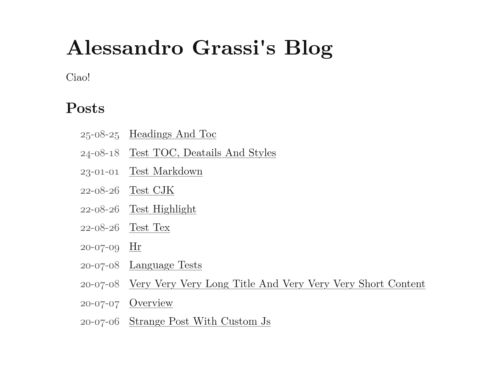
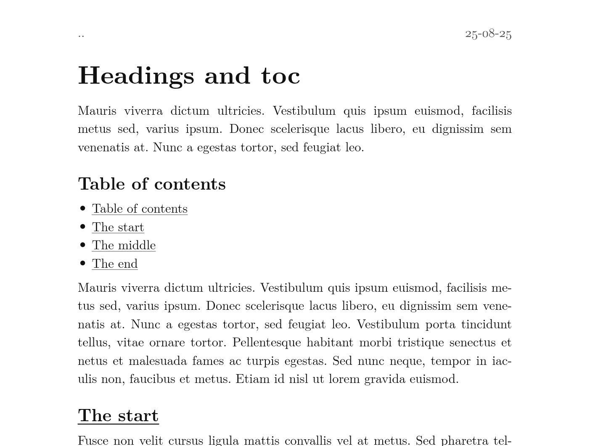

# Foglio — a paper‑like reading theme for Hugo

Foglio (Italian for *sheet of paper*) is a **minimalist, reading‑first** Hugo theme. It aims to feel like reading a well‑set printed page: **black on white, generous margins, and calm typography**.

> No visual noise, just words.

## Preview




## Quick start

```bash
# inside your Hugo site
cd themes
git clone https://github.com/AlessandroGrassi99/foglio
```

In your site `config.toml`:

```toml
theme = "foglio"
```

Build (remember to use Extended Hugo):

```bash
hugo --minify
```

---

## Fonts

Foglio expects the Latin Modern Roman files at `/fonts/lmroman/` (served at site root). The theme ships the SCSS hooks; you should ship the font files.

Place the webfonts in your **site** at `static/fonts/lmroman/` so they publish to `/fonts/lmroman/`:

```
static/
└── fonts/
    └── lmroman/
        ├── LMRoman10-Regular.woff2
        ├── LMRoman10-Regular.woff
        ├── LMRoman10-Italic.woff2
        ├── LMRoman10-Italic.woff
        ├── LMRoman10-Bold.woff2
        ├── LMRoman10-Bold.woff
        ├── LMRoman10-BoldItalic.woff2
        └── LMRoman10-BoldItalic.woff
```

---

## Configuration

Foglio is intentionally light on knobs. The defaults are sensible; customize only what you need.

```toml
[params]
  [params.theme_config]
    back_home_text    = ".."          # back link text
    date_format       = "2006-01-02"  # Go time format
    isListGroupByDate = false         # posts list groups by year if true
    isShowFooter      = true          # render footer if layouts/footer.md present
```

### Site title & description

Set your site title in `config.toml`:

```toml
title = "Your Site Title"
[params]
  description = "Optional one‑line description under the homepage title."
```

Toggle the homepage description with:

```toml
[params.theme_config]
  show_description = true
```

### Menu

Foglio renders a simple, flexible menu from `data/menu.toml`.

```toml
[[entries]]
  title = "Posts"
  [entries.post_list]
  limit = 20
  show_more = true
  show_more_text = "See archive..."
  show_more_url = "posts"
```

Entries can nest via `entries = []`, link with `url`, or auto‑list posts with `post_list`.

### Posts & pages

* Add content under `content/`. Section pages (e.g., `content/posts/_index.md`) render lists automatically.
* Per‑page **table of contents**: set `toc: true` (and optional `tocBorder: true`) in front matter.
* Optional **per‑page JS**: add `custom_js = ["mouse_coords"]` to a page’s front matter to load `assets/js/mouse_coords.js`.

### Math

Enable MathJax on any page with front matter:

```yaml
mathjax: true
```

Use `$…$` / `$$…$$` or `\( … \)` / `\[ … \]`.

### Footer

If `isShowFooter = true`, Foglio will render Markdown found in `layouts/footer.md`. Create that file in **your site** to customize the footer.

---

## Development

* Requires **Hugo Extended** (for SCSS).
* SCSS entrypoint: `assets/css/main.scss` (compiled + fingerprinted).
* Templates live under `layouts/` and use small, readable partials.

Run a local server:

```bash
hugo server -D
```

## License

Foglio is released under the **MIT License**. See `LICENSE`.
